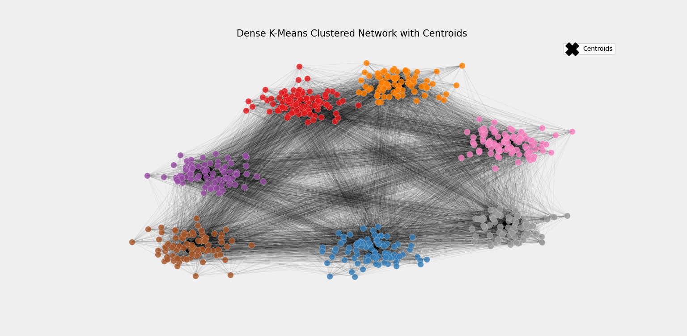
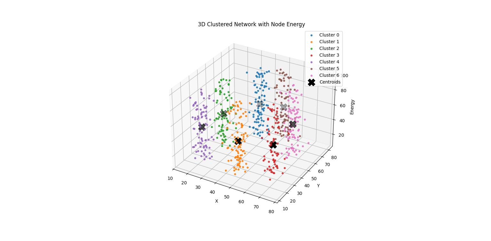
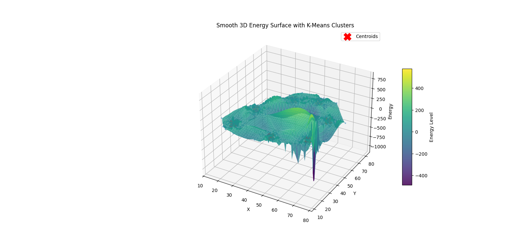

## Files Included
| File | Description |
|------|-------------|
| `kmeans.py` | Main Python script implementing Densest K-Means clustering |
| `cmd_run.png` | CMD execution screenshot proving successful script run |
| `K7_output.png` | K=7 clustering output (matches Figure_4.jpg with 7 clusters) |
| `k3_output.png` | K=3 clustering output for comparison |

## CMD Execution Proof

## Outputs

